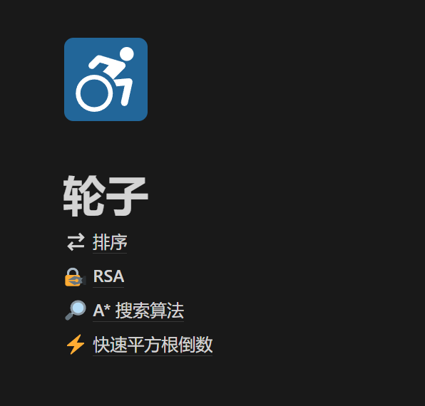
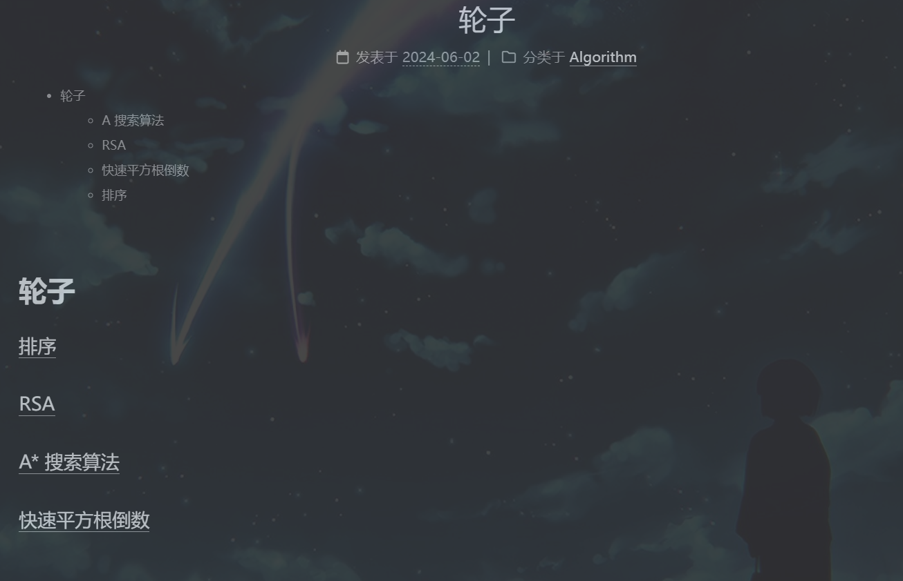
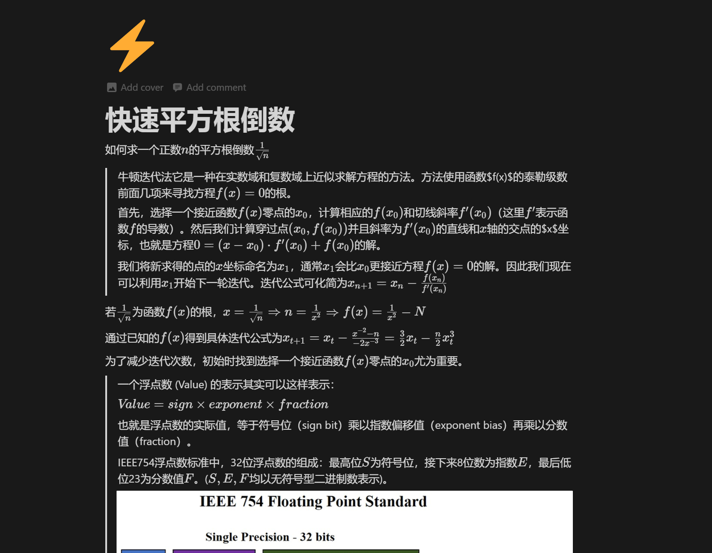
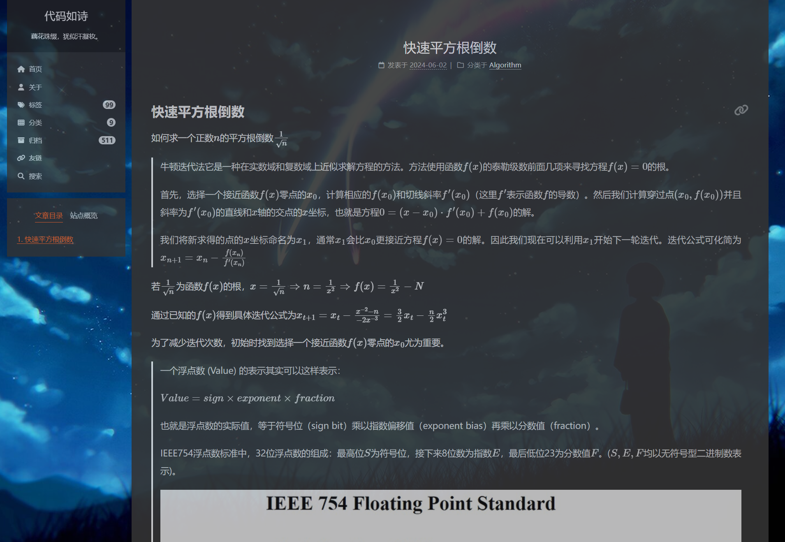
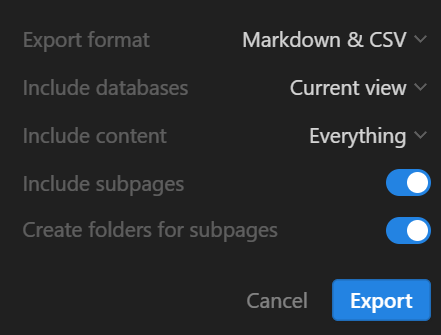
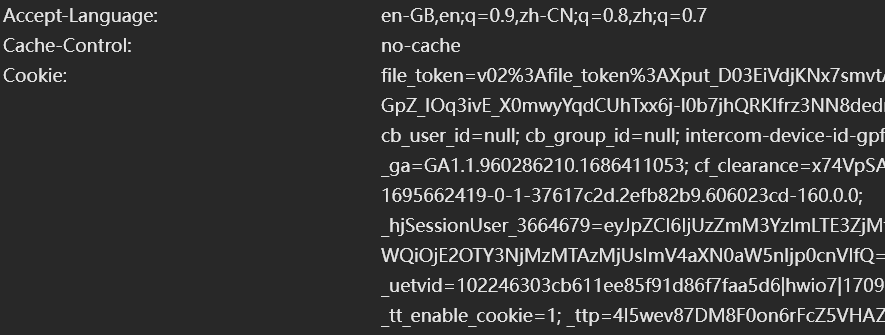

# Notion笔记页面 同步 Hexo博客文章

# 能够做什么

将Notion笔记页面及嵌套的子页面同步到Hexo博客中

  
  
  
  

# 如何使用
1. 将需要同步的Notion页面导出为markdown文件压缩包
      
2. 在部署本项目web端后，会提供文件上传接口，将压缩包上传后，会生成博客文章到预先定好的博客目录下。
3. 最理想的一种方式，由于导出会将下载链接发送到邮箱，只需要监听邮箱的就可以了，利用GitHub Action的workflow定时执行邮件检测的脚本，然后更新至博客仓库。

# 部署
## Docker部署web端

修改`docker-compose.yml`后，运行`docker compose up -d`
``` yml
version: '1.0'
services:
  notion2hexo:
    build: 
      context: .
      dockerfile: Dockerfile
    container_name: notion2hexo
    ports:
      - 5000:5000
    environment:
      - HEXO_BLOG=/usr/src/app/blog
      - SECRET_KEY=你的上传密码
    volumes:
      - 你的博客目录:/usr/src/app/blog
```
## CI/CD

先做好以下准备

* 一个GitHub的hexo博客仓库，同时需要在`_config.yml`中设置`post_asset_folder: true`，让每篇博客可以对应一个同名的静态资源文件夹
* 在Github设置中创建一个对你博客仓库具有读写权限的PersonalAccessToken
* 将本项目提交到Github仓库，在仓库设置中创建一些secrets，分别是：
    * `EMAIL_USERNAME` 邮箱名
    * `EMAIL_PASSWORD` 邮箱的授权码
    * `NOTION_FILE_TOKEN` Notion文件下载的`file_token`，浏览器的cookie中可以找到，估计有一年的有效期。如果找不到，就用浏览器访问导出的下载链接，可以看到请求头里的cookie中有`file_token`
    

修改`.github/workflows/recive_mail.yml`，再将本项目提交GitHub仓库。

``` yml
# This is a basic workflow to help you get started with Actions


name: notion2hexo


on:
  schedule:
    - cron: '*/30 * * * *'  # 30 分钟一次
  # Allows you to run this workflow manually from the Actions tab
  workflow_dispatch:

jobs:
  build:
    runs-on: ubuntu-latest

    steps:
    
    
    - name: Checkout this repository
      uses: actions/checkout@v4

    - name: Checkout blog repository
      uses: actions/checkout@v4
      with:
        repository: 修改仓库地址 例如grainmad/grainmad_blog
        path: grainmad_blog
        token: ${{ secrets.PERSONAL_ACCESS_TOKEN }}
    
    - name: python environment
      uses: actions/setup-python@v4.5.0
      with:
        python-version: "3.10"

    - name: gen blog file
      env:
        EMAIL_USERNAME: ${{ secrets.EMAIL_USERNAME }}
        EMAIL_PASSWORD: ${{ secrets.EMAIL_PASSWORD }}
        NOTION_FILE_TOKEN: ${{ secrets.NOTION_FILE_TOKEN }}
        IMAP_SERVER: imap.qq.com 如果不是qq邮箱就要改
        HEXO_BLOG: ${{ github.workspace }}/grainmad_blog
      run: |
        pip install -r requirements.txt
        mkdir uploads
        python email_handler.py
  
    - name: Commit and push changes
      run: |
        cd grainmad_blog
        git config --global user.name "github-actions[notion2hexo bot]"
        git config --global user.email "github-actions[notion2hexo bot]@users.noreply.github.com"
        if [ -n "$(git status -s)" ]; then
          git add .
          git commit -m "notion2hexo synchronization"
          git push origin main
        else
          echo "No changes to commit"
        fi
      env:
        GITHUB_TOKEN: ${{ secrets.PERSONAL_ACCESS_TOKEN }}
```

# TODOLIST
- [x] 上传notion页面压缩包
- [x] 解压得到文件夹。文件夹命名`notion [12code]`，文件夹内的目录和文件的名称模式是`逻辑名称 哈希值`
- [x] 拷贝解压文件夹，作备份
    - [x] 去除文件夹/文件名中的哈希值
    - [x] 去除文件中包含在链接中的哈希值
- [x] 拷贝解压文件夹，转化为hexo博客文章 
    - [x] 获取文件夹结构数据，生成json数据
    - [x] 重命名文件夹为其哈希值末12位，重命名`.md`为其哈希值末12位+`.md`，其他文件不变
    - [x] 在所有markdown文件内，替换`[file](folder/file [32code].md)`为`[file]([12code]/)`, 替换`[file](folder/file.png)`为``。
    - [x] 为文件添加头部博客信息
        - [x] `title` 文件名，设置为：名称
        - [x] `date` 创建时间，若为新增则设置当前时间
        - [x] `updated` 更新时间，比较旧文章内容，不一致则设置当前时间
        - [x] `tag` 标签， 祖先节点列表
        - [x] `categories` 根节点
        - [x] `mathjax` true
        - [x] `comments` true
        - [x] `description` 
            - 非叶子节点：子树结构展示名称，通过html的列表标签表示，文本左对齐。
            - 叶子节点：展示前20行。落在代码块内，则将代码块展示完全
        