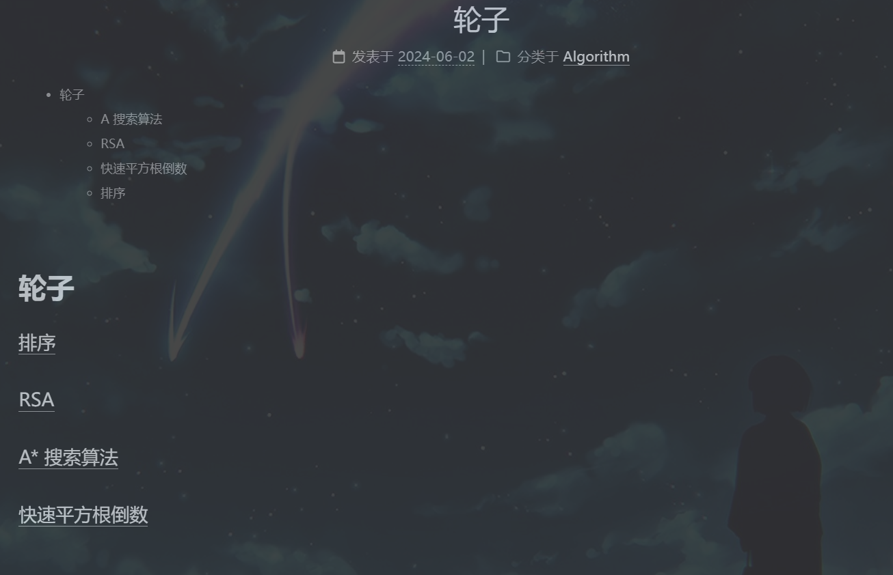
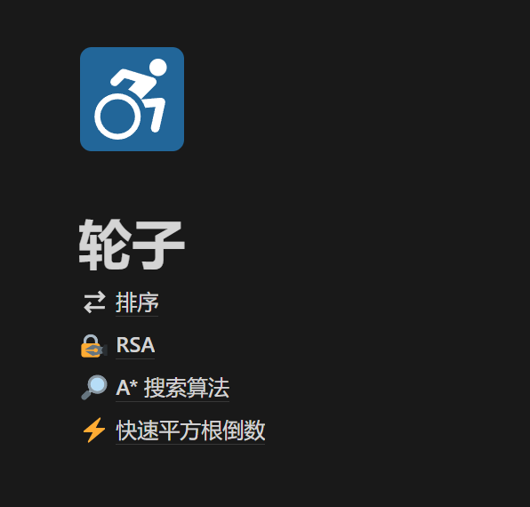
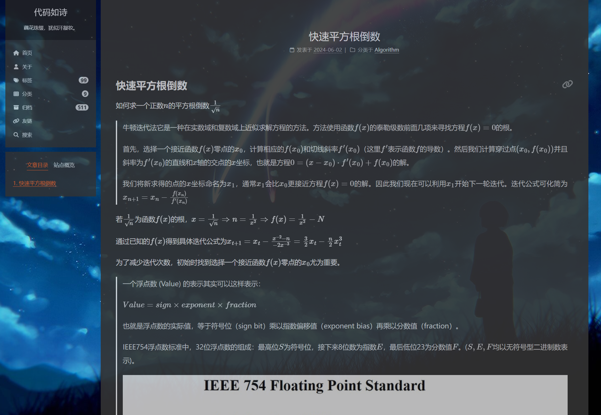
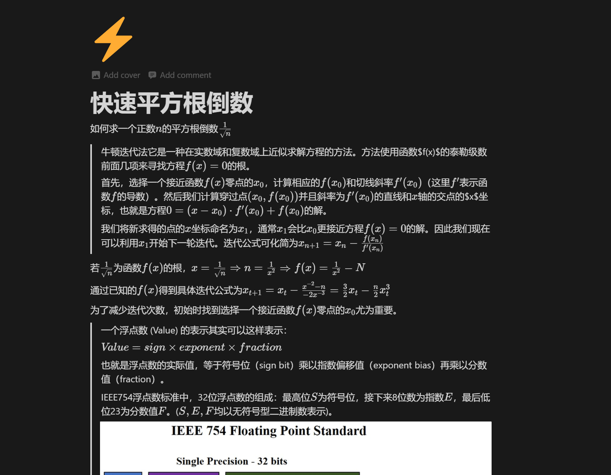

# Notion笔记页面 同步 HexoNexT博客文章

# 能够做什么

将Notion笔记页面及嵌套的子页面同步到Hexo博客中

    
   

# 如何使用
1. 将需要同步的Notion页面导出为markdown文件压缩包
2. 在部署本项目后，会提供文件上传接口，将压缩包上传后，会生成博客文章到预先定好的博客目录下

# Docker部署

# TODOLIST
- [x] 上传notion页面压缩包
- [x] 解压得到文件夹。文件夹命名`notion [12code]`，文件夹内的目录和文件的名称模式是`逻辑名称 哈希值`
- [x] 拷贝解压文件夹，作备份
    - [x] 去除文件夹/文件名中的哈希值
    - [x] 去除文件中包含在链接中的哈希值
- [x] 拷贝解压文件夹，转化为hexo博客文章 
    - [x] 获取文件夹结构数据，每个元素：哈希`hash`，名称`name`，类型`type`，祖先节点列表`ancestor`，直接子元素列表`son`
    - [x] 重命名文件夹为其哈希值末12位，重命名`.md`为其哈希值末12位+`.md`
    - [x] 替换`[file](folder/file [32code].md)`为`[file]([12code]/)`, 替换`[file](folder/file.png)`为``。
    - [x] 为文件添加头部博客信息
        - [x] `title` 文件名，设置为：名称
        - [x] `date` 创建时间，若为新增则设置当前时间
        - [x] `updated` 更新时间，比较旧文章内容，不一致则设置当前时间
        - [x] `tag` 标签， 祖先节点列表
        - [x] `categories` 根节点
        - [x] `mathjax` true
        - [x] `comments` true
        - [x] `description` 
            - 非叶子节点：子树结构展示名称，通过html的列表标签表示，文本左对齐。
            - 叶子节点：展示前15行
        

hexo博客需要`post_asset_folder: true`，每篇博客可以对应一个同名的静态资源文件夹

博客文章包含的其他文章链接，采用的相对路径。在主页会失效，建议不要让description包含这些链接。永链的前缀也应该一致。